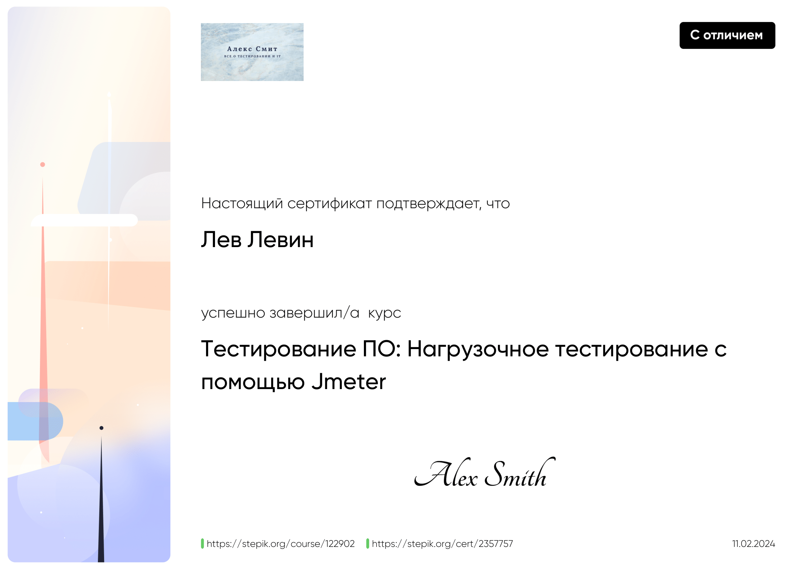

<table>
  <tr>
    <th colspan="2" style="text-align:center;"><h3>Postman</h3></th>
  </tr>
  <tr>
    <td width="30%">

 Test automation for REST API with Postman
 API automation
 Infrastructure & Notifications
 Basics of JavaScript
 Libraries node.js and chai.js
 API Work

  </td>
    <td width="70%">
      
    </td>
  </tr>

   <tr>
    <th colspan="2" style="text-align:center;"><h3>Postman automation</h3></th>
  </tr>
  <tr>
    <td width="30%">

 Test automation for REST API with Postman
 API automation
 Infrastructure & Notifications
 Basics of JavaScript
 Libraries node.js and chai.js
 API Work

  </td>
    <td width="70%">
      
    </td>
  </tr>
  
  <tr>
    <th colspan="2" style="text-align:center;"><h3>Software Testing: Load testing using Jmeter</h3></th>
  </tr>
  <tr>
    <td width="30%">

 API automation
 Load testing
 Groovy

  </td>
    <td width="70%">
      
    </td>
  </tr>
  
  <tr>
    <th colspan="2" style="text-align:center;"><h3>SQL basics</h3></th>
  </tr>
  <tr>
    <td width="30%">

 Simple SQL queries
 Add, change, delete
 Creating Tables
 Indexes
 Search text
 Data grouping
 Multiple table queries (JOIN, UNION)
 Nested queries

  </td>
    <td width="70%">
      
    </td>
  </tr>
  

<tr>
    <th colspan="2" style="text-align:center;"><h3>Postman automation</h3></th>
  </tr>
  <tr>
    <td width="30%">

 Test automation for REST API with Postman
 API automation
 Infrastructure & Notifications
 Basics of JavaScript
 Libraries node.js and chai.js
 API Work

  </td>
    <td width="70%">
      
    </td>
  </tr>
